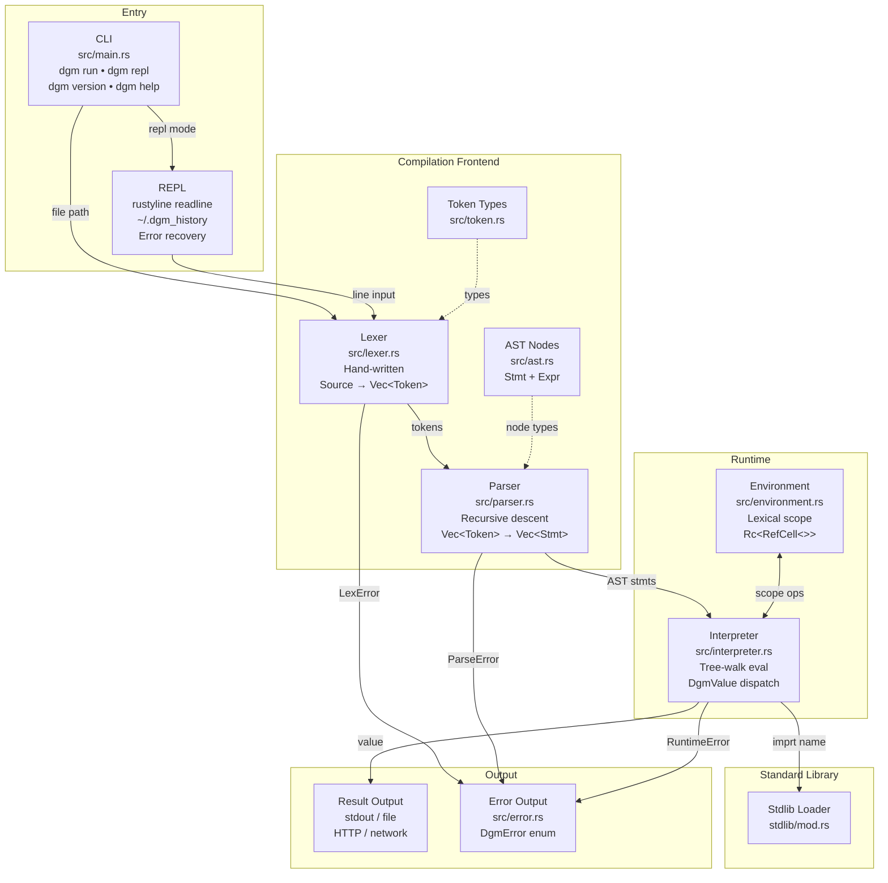
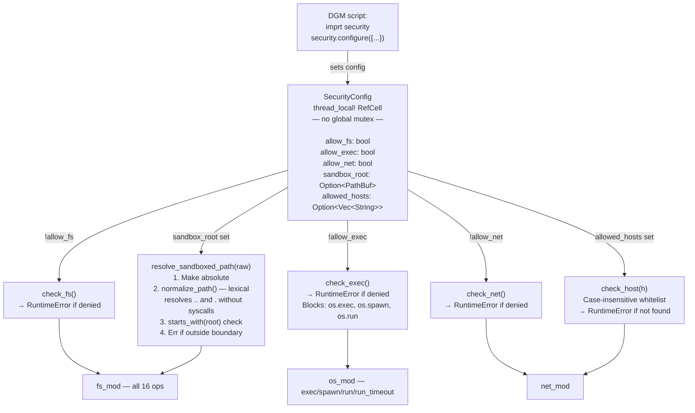
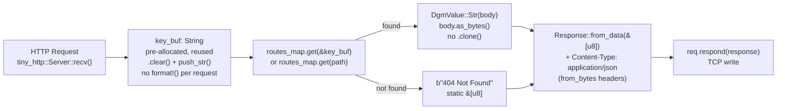
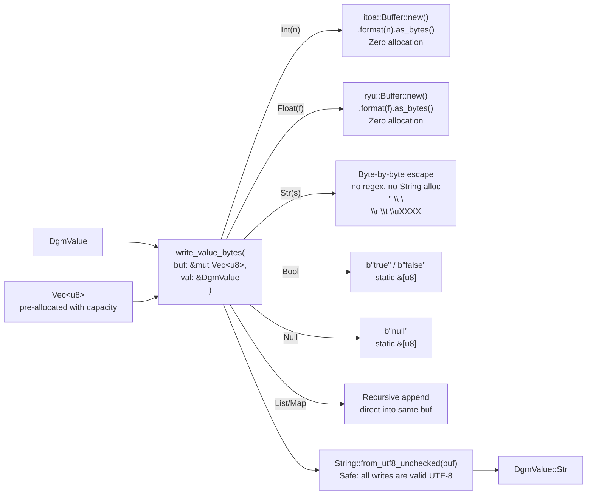

# DGM Language — Project Workflow

> **DGM Alpha_Major_1** — A dynamically typed interpreted language written in Rust.
> Named after **Dang Gia Minh**. Built from scratch, zero parser generators, zero parser combinators.

---

## Table of Contents

- [Project Structure](#project-structure)
- [Pipeline Overview](#pipeline-overview)
- [Phase 1 — Compilation Frontend](#phase-1--compilation-frontend)
- [Phase 2 — Interpreter & Runtime](#phase-2--interpreter--runtime)
- [Phase 3 — Standard Library](#phase-3--standard-library)
- [Phase 4 — Security Layer](#phase-4--security-layer)
- [Phase 5 — HTTP & JSON Hot Path](#phase-5--http--json-hot-path)
- [Build Artifacts (target/)](#build-artifacts-target)
- [Performance Metrics](#performance-metrics)
- [Development Phases Completed](#development-phases-completed)

---

## Project Structure

```
dgm-source/
├── workflow.flyde          # Visual flow graph (Flyde format)
├── WORKFLOW.md             # This document
├── README.md               # Project readme + license
│
└── dgm/                    # Rust crate root
    ├── Cargo.toml          # Manifest + dependencies
    ├── Cargo.lock          # Locked dependency versions
    │
    ├── src/                # Source code
    │   ├── main.rs         # CLI entry point + REPL loop
    │   ├── lexer.rs        # Hand-written tokenizer
    │   ├── token.rs        # Token type definitions
    │   ├── parser.rs       # Recursive descent parser
    │   ├── ast.rs          # AST node type definitions (Stmt, Expr)
    │   ├── interpreter.rs  # Tree-walk interpreter + DgmValue enum
    │   ├── environment.rs  # Lexical scope chain (Rc<RefCell<>>)
    │   ├── error.rs        # Error types (DgmError enum)
    │   │
    │   └── stdlib/         # Standard library modules
    │       ├── mod.rs          # Module loader (load_module dispatch)
    │       ├── math.rs         # Math functions
    │       ├── io_mod.rs       # File I/O (no sandbox)
    │       ├── fs_mod.rs       # Sandboxed filesystem operations
    │       ├── os_mod.rs       # OS process + environment control
    │       ├── json_mod.rs     # JSON encode/decode (byte-level optimized)
    │       ├── http_mod.rs     # HTTP client (ureq) + server (tiny_http)
    │       ├── crypto_mod.rs   # SHA256, MD5, Base64, HMAC
    │       ├── regex_mod.rs    # Regular expressions (regex crate)
    │       ├── net_mod.rs      # Raw TCP networking
    │       ├── time_mod.rs     # Timestamps, formatting (chrono)
    │       ├── thread_mod.rs   # Thread spawning
    │       ├── xml_mod.rs      # XML parse/stringify (quick-xml)
    │       ├── security.rs     # Thread-local security config + path sandbox
    │       └── tests.rs        # Integration tests (17 tests)
    │
    └── target/             # Rust build artifacts (auto-generated, do not edit)
        ├── debug/          # Debug build output
        │   ├── dgm         # Debug executable
        │   ├── deps/       # Compiled dependency crates (.rlib, .rmeta)
        │   ├── build/      # Build scripts output (proc macros, bindgen)
        │   └── incremental/# Incremental compilation cache
        │
        └── release/        # Release build output (cargo build --release)
            ├── dgm         # Optimized production executable
            ├── deps/       # Release dependency artifacts
            ├── build/      # Release build script outputs
            └── .fingerprint/ # Dependency change tracking cache
```

---

## Pipeline Overview



---

## Phase 1 — Compilation Frontend

### Lexer (`src/lexer.rs`)

```
Source string
    │
    ▼
Character stream
    │
    ├── Identifier / Keyword recognition
    │     let, def, cls, iff, elseif, els, fr, whl, brk, cont
    │     retrun, new, ths, imprt, tru, fals, nul, writ
    │     match, case, thr, try, catch, finally, and, or, not, in
    │
    ├── Number literals    →  Token::Int(i64) | Token::Float(f64)
    ├── String literals    →  Token::Str(String)  [supports escape sequences]
    ├── String interp      →  f"text {expr} text"  →  Token::FString(parts)
    ├── Operators          →  +, -, *, /, %, **, &, |, ^, <<, >>
    ├── Comparison         →  ==, !=, <, >, <=, >=
    ├── Assignment ops     →  =, +=, -=, *=, /=
    └── Punctuation        →  ( ) [ ] { } , . : ->
```

### Parser (`src/parser.rs`)

```
Vec<Token>
    │
    ▼  Recursive descent — no external generators
    │
    ├── parse_stmt()
    │     ├── Let { name, value }
    │     ├── FuncDef { name, params, body }
    │     ├── ClassDef { name, parent?, methods }
    │     ├── If { condition, then, elseif_branches, else? }
    │     ├── For { var, iterable, body }
    │     ├── While { condition, body }
    │     ├── Return(expr?)
    │     ├── Break / Continue
    │     ├── TryCatch { try, catch_var?, catch, finally? }
    │     ├── Throw(expr)
    │     ├── Match { expr, arms, default? }
    │     └── Imprt(name)
    │
    └── parse_expr()  [precedence climbing]
          ├── BinOp { op, left, right }
          ├── UnaryOp { op, operand }
          ├── Call { callee, args }
          ├── FieldAccess { object, field }
          ├── Index { object, index }
          ├── Assign { target, op, value }
          ├── Lambda { params, body }
          ├── Ternary { condition, then, else }
          ├── StringInterp(parts)
          ├── Range { start, end }
          ├── List(items)
          ├── Map(pairs)
          └── New { class_name, args }
```

---

## Phase 2 — Interpreter & Runtime

### DgmValue type hierarchy

```rust
pub enum DgmValue {
    Int(i64),
    Float(f64),
    Str(String),
    Bool(bool),
    Null,
    List(Rc<RefCell<Vec<DgmValue>>>),
    Map(Rc<RefCell<HashMap<String, DgmValue>>>),
    Function { params, body, closure: Rc<RefCell<Environment>> },
    NativeFunction { name, func: fn(Vec<DgmValue>) -> Result<DgmValue, DgmError> },
    Instance { class_name, fields: Rc<RefCell<HashMap<String, DgmValue>>> },
}
```

### Environment scope chain

```
Global scope (Interpreter::globals)
    │
    └── Module scope (imprt)
            │
            └── Function call scope
                    │
                    └── Block scope (if/for/while/try)
                              │
                              └── Nested closures...
```

Each scope: `Rc<RefCell<Environment>>` → parent lookup chain  
No `Rc` cycles — closures hold `Weak` or are broken at scope exit.

---

## Phase 3 — Standard Library

### Module dispatch (`stdlib/mod.rs`)

| DGM call | Module file | Key functions |
|---|---|---|
| `imprt math` | `math.rs` | sin, cos, tan, sqrt, pow, floor, ceil, round, abs, log, random, PI, E |
| `imprt io` | `io_mod.rs` | read_file, write_file, append_file, read_lines, file_size, exists, delete, mkdir, list_dir, rename, copy, cwd, abs_path, is_dir, is_file, input |
| `imprt fs` | `fs_mod.rs` | read, read_bytes, write, write_bytes, append, delete, exists, list, mkdir, rmdir, rename, copy, size, is_file, is_dir, metadata **[sandboxed]** |
| `imprt os` | `os_mod.rs` | exec, spawn, run, run_timeout, wait, env/env_get, set_env/env_set, cwd, chdir, pid, sleep, home_dir, arch, num_cpus, exit, args, platform |
| `imprt json` | `json_mod.rs` | parse, stringify, stringify_bytes, raw_parts, pretty **[byte-level optimized]** |
| `imprt http` | `http_mod.rs` | get, post, put, delete, serve **[pooled response]** |
| `imprt crypto` | `crypto_mod.rs` | sha256, md5, base64_encode, base64_decode, hmac_sha256, random_bytes |
| `imprt regex` | `regex_mod.rs` | test, match, find, find_all, replace |
| `imprt net` | `net_mod.rs` | connect, listen, send, recv, close |
| `imprt time` | `time_mod.rs` | now, format, parse, sleep, local_date |
| `imprt thread` | `thread_mod.rs` | spawn, join, sleep |
| `imprt xml` | `xml_mod.rs` | parse, stringify, query |
| `imprt security` | `security.rs` | configure, status |

---

## Phase 4 — Security Layer



### Path normalization algorithm (no syscalls)

```
Input:  /tmp/sandbox/../../../etc/passwd
Step 1: Already absolute → keep
Step 2: Components: [/, tmp, sandbox, .., .., .., etc, passwd]
         - Push /
         - Push tmp
         - Push sandbox
         - .. → pop sandbox → [/, tmp]
         - .. → pop tmp    → [/]
         - .. → stack empty, skip
         - Push etc
         - Push passwd
Result: /etc/passwd
Step 3: /etc/passwd.starts_with(/tmp/sandbox) → false → BLOCKED 
```

---

## Phase 5 — HTTP & JSON Hot Path

### HTTP response path (zero-copy)



### JSON encoding path (byte-level)



**`json.raw_parts(key, val, ok?)` — static prefix assembly:**

```
b"{\"ok\":true,\""   ← static &[u8], zero alloc
+ key.as_bytes()
+ b"\":"
+ write_value_bytes(val)
+ b"}"
→ from_utf8_unchecked()
→ DgmValue::Str
```

---

## Build Artifacts (`target/`)

> The `target/` directory is **auto-generated** by Cargo. Do not edit or commit to version control. Add to `.gitignore`.

```
dgm/target/
│
├── debug/                          # cargo build (default)
│   ├── dgm                         # Debug executable (unoptimized, debug symbols)
│   ├── dgm.d                       # Makefile dependency file
│   ├── deps/                       # Compiled dependency artifacts
│   │   ├── *.rlib                  # Rust static libraries
│   │   ├── *.rmeta                 # Rust metadata (for incremental builds)
│   │   ├── *.d                     # Dependency tracking files
│   │   └── *.so / *.dylib          # Dynamic libraries (proc macros)
│   ├── build/                      # Build script (build.rs) output
│   │   └── <crate>-<hash>/
│   │       ├── build-script-build  # Compiled build script
│   │       └── out/                # Generated files (bindgen, etc.)
│   └── incremental/                # Incremental compilation cache
│       └── dgm-<hash>/
│           └── s-<session>-<hash>/ # Per-session compilation units
│               ├── *.o             # Object files
│               └── dep-graph.bin   # Dependency graph
│
└── release/                        # cargo build --release
    ├── dgm                         # Optimized executable (LTO, opt-level=3)
    ├── dgm.d                       # Makefile dependency file
    ├── deps/                       # Release dependency artifacts
    ├── build/                      # Release build script output
    └── .fingerprint/               # Per-crate change fingerprints
        └── <crate>-<hash>/
            ├── bin-dgm             # Binary fingerprint
            └── invoked.timestamp   # Last build timestamp
```

**Key files explained:**

| File/Dir | Purpose |
|---|---|
| `target/debug/dgm` | Development binary — slow, with debug symbols, assertions enabled |
| `target/release/dgm` | Production binary — LTO, `opt-level=3`, stripped |
| `target/debug/deps/*.rlib` | Compiled dependency crates as Rust static libs |
| `target/debug/deps/*.rmeta` | Rust metadata used by `rustc` for type checking without re-parsing |
| `target/debug/incremental/` | Incremental compilation cache — dramatically speeds up `cargo check` and `cargo build` after small edits |
| `target/debug/build/*/out/` | Files generated by `build.rs` scripts (e.g., C bindings, version strings) |
| `.fingerprint/` | Cargo's cache invalidation system — tracks which crates have changed since last build |

---

## Performance Metrics

| Metric | Value | Notes |
|---|---|---|
| Throughput | **~660 req/s** | HTTP server benchmark, stable |
| RSS memory | **~32 MB** | Stable under soak testing |
| Memory leaks | **None** | `env.live` stable, no Rc cycles |
| Test suite | **17 tests** | 0 failures, serial execution |
| JSON encode overhead | **~0 alloc** | itoa + ryu + static prefixes |
| HTTP body copy | **0** | `body.as_bytes()` direct write |
| Sandbox syscalls | **0** | Lexical normalization only |

---

## Development Phases Completed

| Phase | Description | Status |
|---|---|---|
| **Foundation** | Lexer, Parser (hand-written), AST, Interpreter, Environment |PASS|
| **Stdlib v1** | math, io, os, json, time, http, crypto, regex, net, thread |PASS|
| **Memory** | Fix `Rc` cycle leaks, environment cleanup, no-leak soak |PASS|
| **Perf A** | RequestShell, pooled JSON encoder (`Vec<u8>`), HTTP byte path |PASS|
| **Perf B** | `json.raw_parts`, itoa/ryu zero-alloc formatting, static prefixes |PASS|
| **Platform C1** | `fs_mod` — 16 sandboxed filesystem operations, buffered I/O |PASS|
| **Platform C2** | `os_mod` — exec/spawn/run/run_timeout/wait, managed child store |PASS|
| **Platform C3** | `security` — thread_local config, path sandbox, exec/net gate |PASS|
| **XML** | `xml_mod` — parse/stringify/query via `quick-xml` |PASS|
